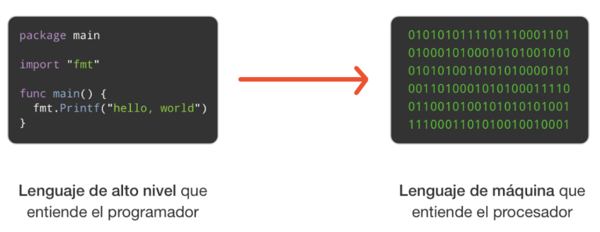
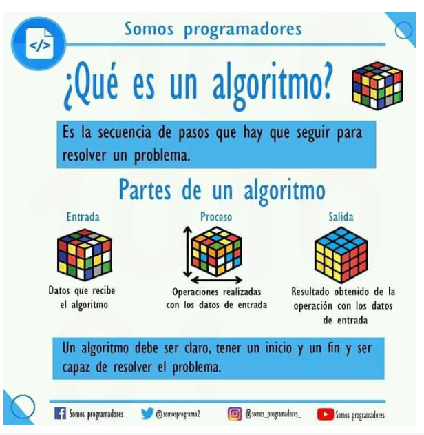

# Introducción a JavaScript


## ¿Qué es JavaScript?

JavaScript es un lenguaje de programación o de secuencias de comandos que permite implementar funciones más complejas en páginas web. Es quien le da **comportamiento** a nuestros sitios web.

### ¿Qué es un programa JavaScript?

Es una **lista de instrucciones** o **declaraciones** que el navegador ejecuta. Un programa JS puede escribirse directamente en el HTML.

## Lenguajes compilados e interpretados

Ambos convierten el código en lenguaje de máquina (el que entienden los procesadores).

### Diferencias:

- **Compilado:** el código se transforma completamente a lenguaje de máquina antes de ejecutarse.
- **Interpretado:** el código se traduce mientras se ejecuta.



### Ejemplos:

- **Compilados:** C, C++, C#, Java  
- **Interpretados:** JavaScript, Python, Ruby

### Ventajas de los lenguajes interpretados

- Ciclo de desarrollo más rápido (no requiere compilación).
- No necesita ejecutables por sistema operativo.
- Simplifica la tarea del programador.

### Ventajas de los lenguajes compilados

- Más rápido en tiempo de ejecución (runtime).
- No requiere intérprete en el equipo del usuario.
- Código optimizado para la ejecución (mayor carga para el desarrollador).

## Expresión vs Declaración

- **Expresión**: produce un valor.

```javascript
3 + 4
nombre + " " + apellido
```

- **Declaración**: realiza una acción.

```javascript
let x = 5;
alert("Hola");
```

## Punto y coma `;`

- Separa las declaraciones.
- Permite escribir varias en la misma línea.

```javascript
let x = 5; let y = 10; alert(x + y);
```

## Espacios en blanco

JavaScript ignora múltiples espacios.  
Se recomienda usarlos para mejorar la legibilidad.

```javascript
let x = 5;
let y = 6;
```

## Palabras clave (keywords)

| Palabra clave | Uso |
|---------------|-----|
| `break`       | Termina un bucle o switch |
| `continue`    | Salta a la siguiente iteración de un bucle |
| `debugger`    | Detiene la ejecución y activa el depurador |
| `do...while`  | Ejecuta el bloque al menos una vez |
| `for`         | Bucle con contador |
| `function`    | Define una función |
| `if...else`   | Condición lógica |
| `return`      | Devuelve un valor en una función |
| `switch`      | Estructura de selección múltiple |
| `try...catch` | Manejo de errores |
| `var`         | Declara una variable (obsoleto, preferir `let` o `const`) |

## Identificadores en JavaScript

- Son los **nombres** que usamos para variables, funciones, etc.
- Deben comenzar con **letra**, **guion bajo `_`** o **signo `$`**.
- No pueden comenzar con números.
- Son **case sensitive** (sensible a mayúsculas/minúsculas).

```javascript
let nombre;
let Nombre; // es diferente a "nombre"
```

## Notación camelCase

Diferentes formas de escribir nombres compuestos:

- `first-name` → ❌ (guión medio)
- `first_name` → ✔️ (guión bajo)
- `FirstName`  → ✔️ (camelCase mayúscula, más común en C#)
- `firstName`  → ✔️ (camelCase minúscula, preferida en JavaScript)

> En JS se recomienda usar **camelCase minúscula**.

## Variables y tipos de datos

#### ¿Qué es una variable?

Una **variable** es un espacio en memoria donde podemos guardar un valor para usarlo más adelante en el programa.

#### Declaración y asignación

En JavaScript usamos palabras clave como `let` y `const` para declarar variables:

```javascript
let nombre = "Ana";
const edad = 25;
```

- `let`: permite reasignar el valor más adelante.
- `const`: no permite cambiar el valor una vez asignado.

#### Tipos de datos primitivos

- **Números** (`number`): `10`, `3.14`, `-5`
- **Cadenas de texto** (`string`): `"Hola"`, `'Mundo'`
- **Booleanos** (`boolean`): `true`, `false`

#### Operaciones matemáticas

```javascript
let suma = 10 + 5;      // 15
let resta = 20 - 3;     // 17
let producto = 4 * 6;   // 24
let division = 8 / 2;   // 4
let resto = 9 % 2;      // 1
```

#### Concatenación de textos

Podemos unir textos (strings) usando el operador `+`:

```javascript
let nombre = "Juan";
let saludo = "Hola, " + nombre;
console.log(saludo); // "Hola, Juan"
```

#### Mostrar información en pantalla

- `console.log()`: muestra en la consola del navegador.
- `alert()`: muestra una ventana emergente (popup).

```javascript
console.log("Mensaje en consola");
alert("Mensaje para el usuario");
```

#### Pedir información al usuario

- `prompt()`: muestra un cuadro para que el usuario escriba algo.

```javascript
let nombre = prompt("¿Cómo te llamás?");
alert("Hola, " + nombre);
```

## Ejemplos de métodos de salida

### innerHTML

```javascript
document.getElementById("demo").innerHTML = "Hola mundo";
```

### document.write()

```javascript
document.write("Texto directo en la página");
```

### window.alert()

```javascript
alert("Esto es un mensaje");
```

### console.log()

```javascript
console.log("Mensaje en consola");
```

### window.print()

JavaScript no tiene acceso directo a dispositivos de impresión.  
Se puede usar:

```javascript
window.print();
```

> Imprime el contenido actual de la ventana del navegador.

## Ejemplos generales

```javascript
let nombreUsuario = "Ana";
let edadUsuario = 30;

console.log("Nombre: " + nombreUsuario);
console.log("Edad: " + edadUsuario);
```

## Características de un algoritmo



- Secuencia de pasos lógicos.
- Claros y finitos.
- Resuelven un problema o tarea específica.

## Formas de incluir JavaScript en HTML

### 1. En el `<head>`

```html
<head>
  <script>
    // Código JS
  </script>
</head>
```

### 2. En el `<body>`

```html
<body>
  <script>
    // Código JS
  </script>
</body>
```

### 3. En archivo externo

```html
<script src="app.js"></script>
```
### Ventajas de usar archivos JS externos

- Separa HTML del código JavaScript.
- Mejora la legibilidad y mantenimiento.
- Acelera la carga (se puede usar caché).
- Se pueden incluir múltiples archivos JS.

### Mostrar información en JavaScript

- `innerHTML`: escribe en un elemento HTML.
- `document.write()`: escribe directamente en la salida HTML.
- `window.alert()`: muestra un cuadro emergente.
- `console.log()`: escribe en la consola del navegador.